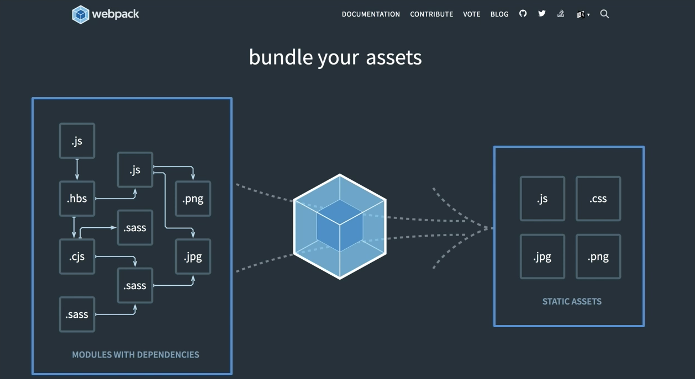

## Module이란?
### Module의 정의
프로그램을 구성하는 내부의 코드가 기능별로 나뉘어져 있는 형태로  
Module을 사용하게 되면 한 파일에 쓰여진 큰 코드 덩어리를 여러 파일로 쪼개서 관리 할 수 있다.  
어떤 기준을 통해 코드가 파일 단위로 분리 되어있는 형태로 서로가 참조 되어있는 형태를 띈다.

### Module의 표준
  
어떤 파일을 Module로 다루기 위해서는 Module System이 있어야한다.  
Module System이 있는 환경은 파일을 하나의 Module로 읽을 수 있다.  
이는 자신의 코드를 다른 곳에서 참조할수 있게 하거나 다른 Module로 부터 특정 기능을 가져와 사용 할 수 있게 하는 키워드를 제공한다.  
Module을 사용하는 방법은 Module이 어떤 표준을 따르느냐에 따라 달라진다.

Module System은 여러가지가 있지만 이번에 살펴볼 두가지 시스템은  
JavaScript의 실행환경인 NodeJS에서 채택한 [CommonJS]라는 표준이 있고, 다른 하나는  
ECMAScript에서 정의한 모듈표준화인 ESM이다.

### Module을 다루는 키워드

####CommonJS
 : `require (참조 하고자 하는 모듈의 경로)`

**module.exports의 형태**  
`module.exports={...}`  
`module.exports= 값`  
`module.exports.키_이름=값`  
`exports.키_이름=값`  
        
[index.js]
```javascript
/***
* 1. 원의 넓이를 구하는 공식
* 2. PI 정의
* 3. 공식을 통해 결과 얻기
***/
   
const PI = 3.14;
const getCircleArea = r => r * r * PI;
   
const result = getCircleArea(2);
console.log(result);
```
실행 명령어  
```shell script
$ node index.js
```
위의 `index.js`코드를 모듈화 한다면 
   
[mathUtil.js]
```javascript
const PI = 3.14;
const getCircleArea = r => r * r * PI;
   
module.exports = {
    PI,
    getCircleArea
}
```
exports를 이용하여 개별적으로 내보낼때  
[mathUtil.js]
```javascript
const PI = 3.14;
const getCircleArea = r => r * r * PI;
   
exports.PI = PI;
exports.getCircleArea;
```
*[mathUtil.js] 둘 중 한가지 방법으로만 사용해야 내보내기의 기능 유실을 막을 수 있다.*
   
[index.js]
```javascript
/***
* 1. 원의 넓이를 구하는 공식
* 2. PI 정의
* 3. 공식을 통해 결과 얻기
***/
   
const { getCircleArea } = require('./mathutil');
   
const result = getCircleArea(2);
console.log(result);
```
 
####ESM 
: `import 모듈_이름 from 모듈_위치`  
**기능을 내보내는 키워드**  
`export`  
`export default`
           
*NodeJS환경에서는 CommonJS모듈을 기본으로 사용하기 때문에 ESM방식의 모듈을 사용하려면 별도의 설치가 필요하다.*
```shell script
$ npm install esm
```
실행 명령어  
( -r을 추가 하게 되면 다른 모듈의 표준`commonJS/ESM 모두 가능`도 실행 할 수 있게 해준다.)
```shell script
$ node -r esm index.js
```
1\. `export`  
[index.js]
```javascript
/***
* 1. 원의 넓이를 구하는 공식
* 2. PI 정의
* 3. 공식을 통해 결과 얻기
***/
   
import { getCircleArea } from './mathUtil'
   
const result = getCircleArea(2);
console.log(result);
```
[mathUtil.js]
```javascript
const PI = 3.14;
const getCircleArea = r => r * r * PI;

export {
    PI,
    getCircleArea
}
```
2\. `export default`  
[mathUtil.js]
```javascript
export default {
    PI,
    getCircleArea
}
```
[index.js]
```javascript
/***
* 1. 원의 넓이를 구하는 공식
* 2. PI 정의
* 3. 공식을 통해 결과 얻기
***/
   
import mathUtil from './mathUtil'
   
const result = mathUtil.getCircleArea(2);
console.log(result);
```
###Module의 종류
1\. Bulit-in Core Module (예: Node.js module)  
내장 되어 있는 코어 모듈로 실행 환경에서 바로 실행 할 수 있게 한다.
* Write Your Code
[src/index.js]
```javascript
import bar from './bar';

bar();
```
[src/bar.js]
```javascript
export default function bar() {
  //
}
```
* Bundle It  
*Without config* or provide custom [webpack.config.js]
```javascript
const path = require('path');

modul.export = {
    entry: './src/index.js',
    output: {
        path: path.resolve(__dirname, 'dist'),
        filename: 'bundle.js'
    }
};
```
[page.html]
```html
<!doctype html>
<html>
    <head>
    ...
    </head>
    <body>
    ...
    <script src="dist/bundle.js"></script>
    </body>
</html>
```
2\. Community-based Module (예: NPM) 
외부 모듈은 NPM이라는 패키지 매니저로 다룰 수 있으며 개인이 만든 모듈을 외부에 공개 할 때 사용되기도 한다.  
-npm CLI를 사용해야 한다 (예: npm install ModuleName)  
모듈의 종류는 [NPMsite] 에서 찾을 수 있다.

3\. Local Module (특정 프로젝트에 정의된 모듈)  
모듈에 사용되는 방식과 위치 되어 있는 공간을 기준으로도 모듈을 구분 할 수 있다.

###Module 예제
도형의 넓이를 구하는 코드를 기능별로 모듈화하기.  

1\. readline  
(NodeJS에서 제공하는 내장 모듈로 사용자로 부터 입력을 받을 수 있게 여러 기능을 제공.)  
[index.js]
```javascript
const readline = require("readline");
const rl = readline.createInterface({
    input: process.stdin,
    output: process.stdout
});

rl.question(
    "넓이를 구하고자 하는 도형의 종류를 입력해주세요. ( 정사각형, 원) :", 
    figure => {
    console.log (`선택된 도형: ${figure}`);
    
    switch (figure) {
      case "정사각형":
        rl.question("변의 길이를 입력 해 주세요. :", input =>{
        console.log(`입력받은 값 : ${input}`);
        console.log(`정사각형의 넓이는 : ${input * input} 입니다.`);
        rl.close();
        });
        break;
        case "원":
          rl.question("반지름의 길이를 입력 해 주세요. :", input =>{
          console.log(`입력받은 값 : ${input}`);
          console.log(`원의 넓이는 : ${input * input * 3.14} 입니다.`);
          rl.close();
          });
        break;
      default:
        console.log(
          "지원되지 않는 도형입니다. '정사각형' 또는 '원'을 입력해주세요. \n커맨드 라인을 종료합니다."
        );
        rl.close();
    }
  }
);
```
위의 코드를 모듈화 하게 되면 :  

[mathUtil.js]
```javascript
const PI = 3.14;
const getCircleArea = r => r * r * PI;
const getSquareArea = d = d * d;

module.exports = {
    PI,
    getCircleArea,
    getSquareArea
}
```
[log.js]
```javascript
const logInput = input => `입력받은 값 : ${input}`;
const logResult = (figure, result) => `${figure}의 넓이는 : ${result} 입니다.`;
const logFigureError = "지원되지 않는 도형입니다. '정사각형' 또는 '원'을 입력해주세요. \n커맨드 라인을 종료합니다.";

module.exports = {
    logInput,
    logResult,
    logFigureError
}
```
[index.js]
```javascript
const readline = require("readline");
const rl = readline.createInterface({
    input: process.stdin,
    output: process.stdout
});

const { getCircleArea, getSquareArea } = require('./mathUtil');
const { logFigureError, logInput, logResult } = require('./log');

rl.question(
    "넓이를 구하고자 하는 도형의 종류를 입력해주세요. ( 정사각형, 원) :", 
    figure => {
    console.log (`선택된 도형: ${figure}`);
    
    switch (figure) {
      case "정사각형":
        rl.question("변의 길이를 입력 해 주세요. :", input =>{
        console.log(logInput(input));
        console.log(logResult(figure, getSquareArea(input)));
        rl.close();
        });
        break;
        case "원":
          rl.question("반지름의 길이를 입력 해 주세요. :", input =>{
          console.log(logInput(input));
          console.log(logResult(figure, getCircleArea(input)));
          rl.close();
          });
        break;
      default:
        console.log(logFigureError);
        rl.close();
    }
  }
);
```

###Module을 사용한다면

1\. 코드의 재사용성이 증가한다.  
2\. 코드의 관리가 편해진다.  
3\. 코드를 모듈화하는 기준이 명확해야 한다.
<br><br>
##Bundle이란?
다양한 파일을 모듈로 다루며 서로 참조 하는 왼쪽 그림에서 번들을 통해 오른쪽의 하나의 파일로 묶는것을 말한다.


###Bundle이 중요한 이유
1\. 모든 모듈을 로드하기 위해 검색하는 시간이 단축된다.  
-모듈을 개별 로드 하는 시간보다 번들로 묶어서 한번에 로드하기 때문에 시간이 단축 된다.

2\. 사용하지 않는 코드를 제거해준다.  
-모듈 내에서 사용되는 기능이 있고, 그렇지 않는 기능이 있는데,   
이때 웹팩을 통해 번들링 된 파일을 살펴 보면 실제 참조 하는 코드들로 만 이루어진 모듈을 볼 수 있다. 

3\. 파일의 크기를 줄여준다.  
-사용되지 않는 기능을 제거하여 파일의 크기를 줄여주는 것 도 있지만,  
여러 곳에서 참조된 모듈들을 압축하는 방식보다 번들링되어 한 곳에 묶여 압축되는 방식이 크기를 줄여주는데 효과적이기 때문이다.


<br><br><br><br><br><br><br>
######*위의 내용은 [fastcampus]의 WEBPACK-백성훈 online 강의를 정리한 내용입니다. 


[NPMsite]: https://www.npmjs.com/
[fastcampus]: https://www.fastcampus.co.kr/
